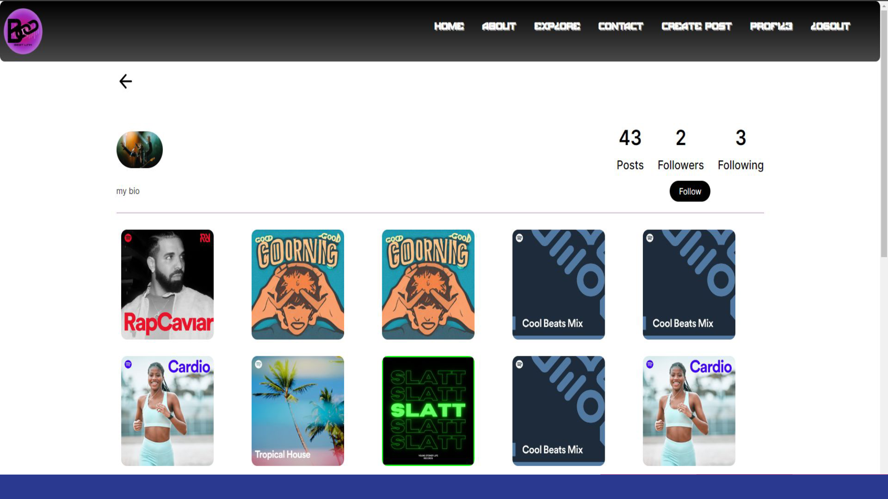

# Social Playlist Network

A full-stack web app that allows users to import, share, and discover playlists from Spotify.  
Featuring AI-powered music recommendations, social interaction, and playlist cross-sharing.

---

## UI Preview

User profile page with imported playlists from Spotify:

---

## Key Features

- Import playlists from Spotify
- Discover playlists shared by other users  
- Like and comment on posts  
- AI-powered playlist and song recommendations  
- Follow users and build a social music feed  
- Share your own playlists and let others import them

---

## Tech Stack

**Frontend:** JavaScript, Next.js  
**Backend:** Node.js, Express  
**Database:** MongoDB  
**APIs:** Spotify API, OpenAI API  
**Deployment:** Vercel (frontend), AWS (backend)  
**Version Control:** Git, GitHub

---

## Hosting Status

This project is not currently deployed.  

---

## Development Highlights

- Co-developed an application integrating Spotify and OpenAI APIs for personalized playlist recommendations  
- Implemented key features including public feed, user search, playlist import, and a commenting system  
- Deployed the application using Vercel (for the Next.js frontend) and AWS (for backend services and file storage)

---

## Team Members

- [Zuby A.](https://github.com/keyprocedure)
- [Anthony B.](https://github.com/stackanthony)
- [Anna F.](https://github.com/VZZVWE0)
- [Guillermo A.](https://github.com/galcantara99)
- [Warisha V.](https://github.com/wvahidy)
- [Yash B.](https://github.com/Yashbhadiyadra)
